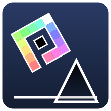

# Event
On 22nd November 2022, this website was used to allow 14,000 people to collaborate on a single Geometry Dash level. A video showcasing the things they built can be found [here](https://youtu.be/XZXZGOkJ92w). The final level was uploaded to Spu7Nix's Geometry Dash account - id: `86917672`

# GD-Place
GD-Place is a massive [r/place](https://en.wikipedia.org/wiki/R/place)-style collaborative [Geometry Dash](https://en.wikipedia.org/wiki/Geometry_Dash) level-editor. This website is built to be performant on both mobile and PC devices, and handles thousands of simultaneous users building together. The front end was created using Svelte, while the back end (authentication and server) was handled by Firebase. The history of the entire event, which includes all objects placed and deleted, and by who, was saved and can be found [here](https://github.com/Spu7Nix/gd-place-data).
It was created by [@Spu7Nix](https://github.com/Spu7Nix), [@FlowVix](https://github.com/FlowVix) and [@DexterHill0](https://github.com/DexterHill0) with help from [@GDColon](https://github.com/GDColon).

A high-resolution image of the full canvas is included with the code, called `full_canvas.tiff`.

